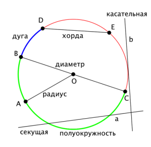
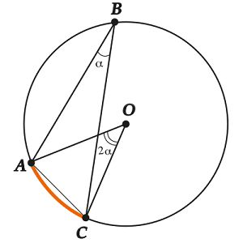
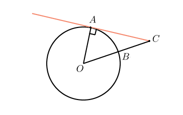

# Окружность
* **def**: **Окружность** - Геометрическое место точек, **равноудалённых** от фиксированной точки, называемой **центром окружености**  
_прим._ Точки, лежащие внутри окружности (включая её центр) не принадлежат окружности.

## Основные понятия

  * _**def**:_ **Радиус** - отрезок, соединяющий точку, лежащую на окружности с центром данной окружности. 
  * _**def**:_ **Хорда** - отрезок, соединяющий две точки, лежащии на окружности.
  * _**def:**_ **Диаметр** - хорда, проходящая через центр окружности.
  * _**def**:_ **Секущая** - прямая, пересекающая окружность в двух точках.
  * _**def**:_ **Касательная** - прямая, имеющая одну общую точку с окружностью.
  * _**def**:_ **Дуга** - одно из двух подмножество окружности, на которые её делят 2 различные принадлежащие ей точки.
  * _**def**:_ **Полуокружность** - дуга, опирающаяся на диаметр (половина окружности _(кто бы мог подумать)_  )

  

  * **_def_:** **Вписанный угол** - угол, вершина которого принадлежит окружности.
  * **_def_:** **Центральный угол** - угол, вершина которого лежит в центре окружности.

  

## Важные свойства окружности
  1. Касательная перпендикулярна радиусу, _проведённому к точке касания_.

  

  2. **Все** вписанные углы, _опирающиеся на одну дугу_ равны половине центрального угла, опирающегося на эту дугу.
  
  3.  **_Формулы_** 
      * важные _(обязательно выучить)_
          1. Диаметр: $D = 2R$ 
          2. Длина: $C = 2\pi R$ 
          3. Площадь: $S = \pi R^2$ 
      * остальные _(полезны, но выводятся из важных)_ 
          1. Радиус: 
          2. Диаметр:
          3. Длина:
          4. Площадь:     

    
